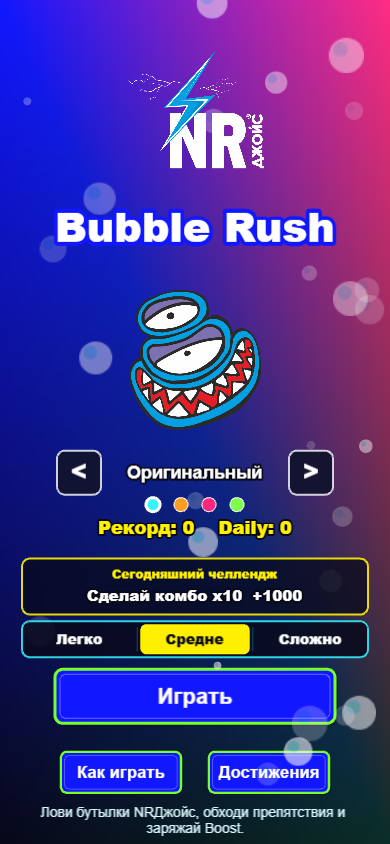
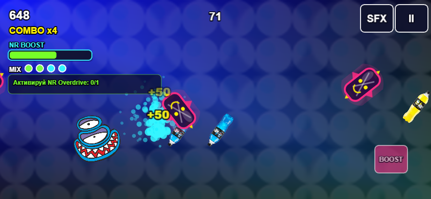
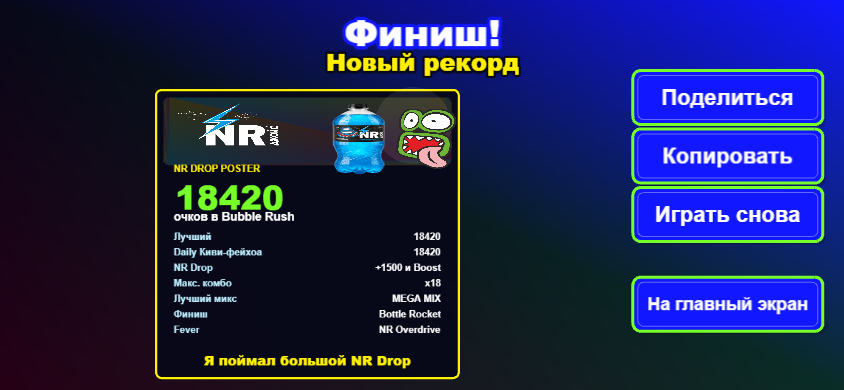
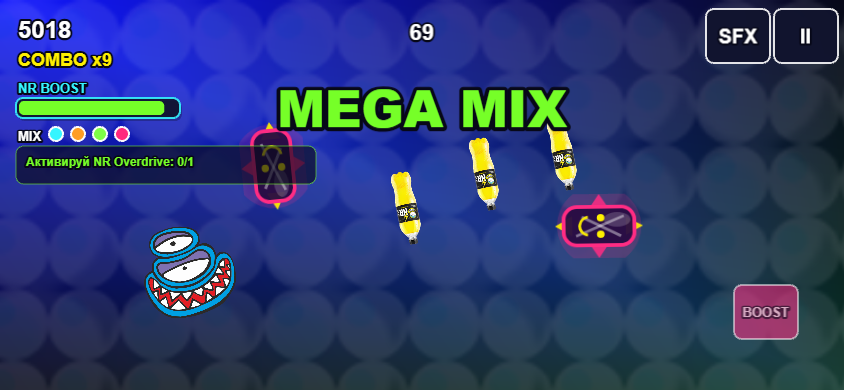
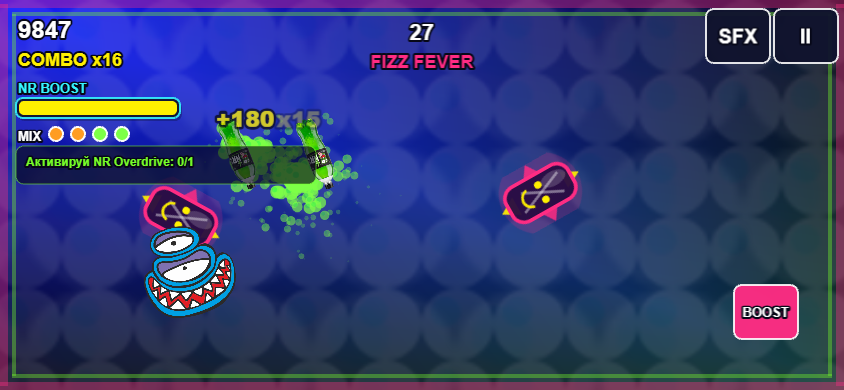
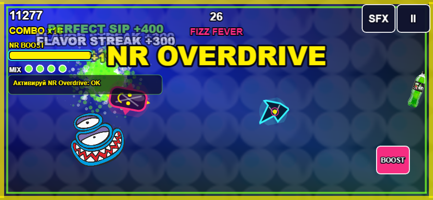
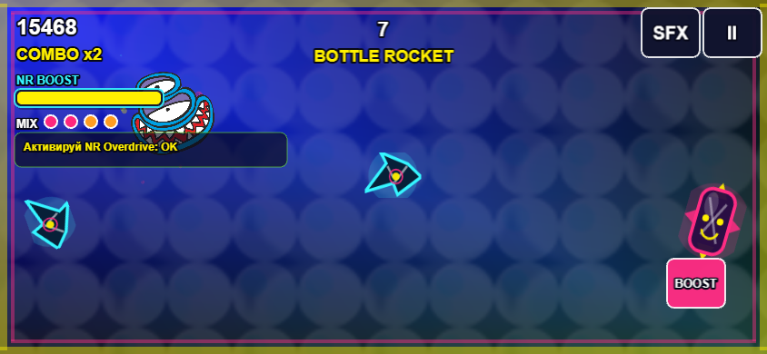

# NRДжойс: Bubble Rush

Браузерная промо-игра для бренда NRДжойс: быстрый аркадный раннер, где игрок управляет маскотом, ловит бутылки и вкусовые бонусы, собирает комбо, заряжает `NR Boost` и уклоняется от препятствий.

[Играть онлайн](https://aiden3630.github.io/nr-joice_game/) | [GitHub](https://github.com/Aiden3630/nr-joice_game)

<p align="center">
  
  
  
</p>

## Что это

`NRДжойс: Bubble Rush` - короткая PWA-игра для мобильных устройств и desktop. Проект сделан как промо-механика для бренда: игрок проходит заезд, набирает очки, открывает комбо-события и получает брендированную карточку результата, которой можно поделиться.

## Что реализовано

- Игровой цикл на 75 секунд с очками, таймером, препятствиями и бонусами.
- Управление для телефона/планшета свайпом и для desktop через клавиатуру.
- Выбор маскота и вкуса на стартовом экране.
- `NR Boost` со щитом и множителем очков.
- `Taste Mix Combo`: цепочки вкусов дают `FLAVOR STREAK`, `NR MIX` или `MEGA MIX`.
- `FIZZ FEVER`: спец-фаза с повышенной плотностью бонусов и `NR OVERDRIVE`.
- `Bottle Rocket Finish`: ускоренный финальный отрезок заезда.
- `Perfect Sip Streak`: награда за чисто собранные цепочки бонусов.
- Daily Rush без backend: дневной вкус и отдельный дневной рекорд.
- Достижения, локальный рекорд и сохранение прогресса через `LocalStorage`.
- Брендированная карточка результата с кнопками share/copy.
- PWA manifest, service worker и Android-сборка через Capacitor.

## Личный вклад

Я разработал игровую механику, сцены `Boot`, `Preload`, `Menu`, `Game`, `Pause`, `Result`, HUD, систему очков, комбо, бонусы, препятствия, Boost-режимы, сохранение прогресса, адаптацию под mobile/desktop, PWA-сборку, тесты и скрипты для подготовки конкурсного комплекта.

## Технологии

- TypeScript
- Phaser 3
- Vite
- HTML/CSS
- PWA Manifest
- Service Worker
- LocalStorage
- Vitest
- Playwright
- Capacitor
- Node.js scripts

## Скриншоты

<p>
  
  
</p>

<p>
  
  
</p>

<p>
  
  
</p>

Полный набор скриншотов для GitHub-страницы лежит в `docs/screenshots/`. Материалы для сдачи проекта находятся в `delivery/`, но эта папка не хранится в Git, потому что содержит сборки, архивы, APK и временные медиафайлы.

## Запуск локально

```bash
npm install
npm run dev
```

Проверка типов и тестов:

```bash
npm run lint
npm run test
```

Production-сборка:

```bash
npm run build
npm run preview
```

## Структура проекта

```text
src/
  scenes/      игровые сцены Phaser
  systems/     игровые системы: очки, комбо, Boost, события
  entities/    игрок, бонусы, препятствия, предметы
  ui/          HUD, кнопки, карточка результата
  utils/       математика, сохранение, адаптация, коллизии
public/
  assets/      оптимизированные бренд-ассеты
docs/
  screenshots/ изображения для GitHub-страницы
```

## Сборка конкурсного комплекта

```bash
npm run package:delivery
```

Команда собирает `delivery/` с PWA-сборкой, исходниками, Android APK, документацией, скриншотами и демо-видео.

## Промо-применение

В коммерческой версии очки могут превращаться в небольшие скидочные бонусы на продукцию NRДжойс: результат заезда открывает QR-код или промокод с лимитированной скидкой. В текущем прототипе скидки не выдаются автоматически; для этого нужен отдельный backend или промокодный модуль с лимитами, антифродом и правилами акции.

## Ассеты

Оптимизированные игровые копии лежат в `public/assets/brand/`. Исходные бренд-материалы остаются в папке `бренд/`.
